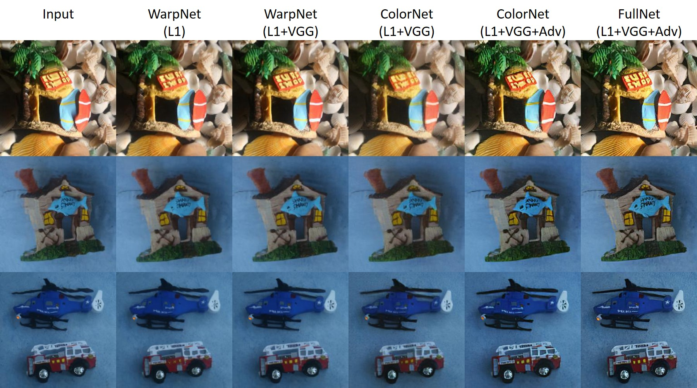

# TurbulentWater
Code for "Learning to See through Turbulent Water" WACV 2018

## instructions
- download train.zip, val.zip and test.zip from http://cseweb.ucsd.edu/~viscomp/projects/WACV18Water/
- unzip train.zip into DATAROOT/Water
- unzip val.zip into DATAROOT/Water (note these images correspond to the ImageNet test set)
- unzip test.zip into DATAROOT/Water_Real
- dowanload the origional ImageNet training and test sets to DATAROOT/ImageNet/

python main.py --dataroot DATAROOT

